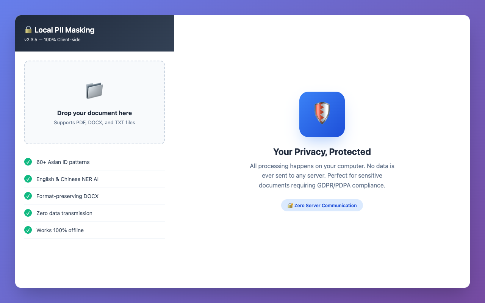
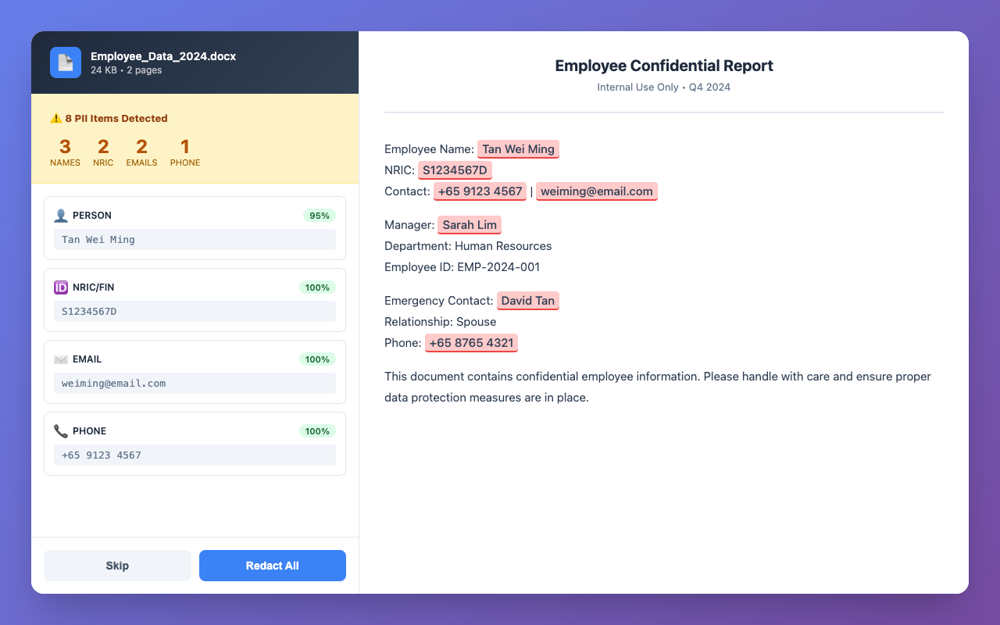
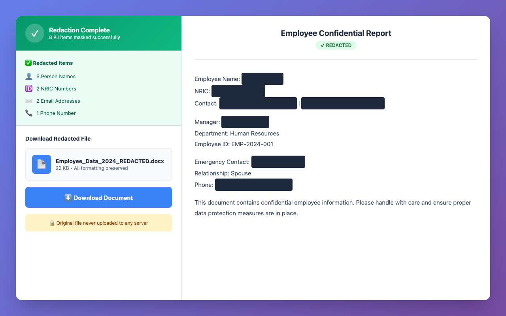
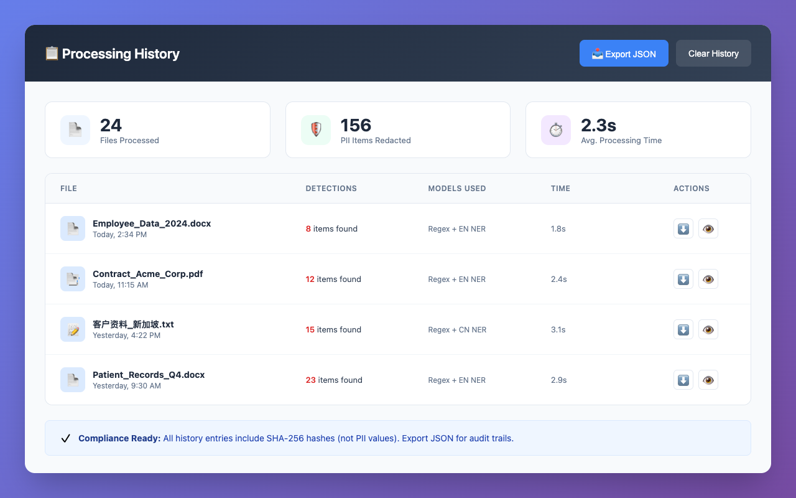

# 🔒 Local PII Masking

**Enterprise-grade PII detection and masking that runs entirely in your browser.**

[](./package.json)
[](./LICENSE)
[](./docs/PRIVACY_POLICY.md)

> **Zero server communication. Zero data transmission. Zero trust required.**

[Features](#features) • [Quick Start](#quick-start) • [Privacy](#privacy--security) • [Documentation](#documentation) • [Chrome Extension](#chrome-extension)

---

## 🎯 Why Local PII Masking?

| Problem | Solution |
|---------|----------|
| **"I don't trust cloud services with sensitive documents"** | Everything processes locally. No upload. No server. |
| **"Compliance requires data to stay in-country"** | 100% client-side = data never leaves your device |
| **"I need to redact PII before sharing"** | AI-powered detection + one-click masking |
| **"I work with Chinese documents too"** | Bilingual AI: English + Chinese NER models |

---

## ✨ Features

### 🔐 Privacy-First Architecture
- **100% Client-Side** — No data transmission, ever
- **Zero Server Communication** — All processing in browser
- **Local AI Models** — Download once, run offline forever
- **No Telemetry** — No tracking, no analytics, no cookies

### 🤖 AI-Powered Detection
- **60+ Asian ID Patterns** — NRIC (SG), MyKad (MY), Aadhaar (IN), HKID, and more
- **English NER** — Names, organizations, locations (BERT-based)
- **Chinese NER** — 中文人名、机构、地点识别 (Chinese BERT)
- **Regex Detection** — Emails, phones, credit cards, addresses

### 📄 Document Support
| Format | Parse | Redact | Preserve Formatting |
|--------|-------|--------|---------------------|
| PDF | ✅ | ✅ | Flattened output |
| DOCX | ✅ | ✅ | Tables, styles, images intact |
| TXT | ✅ | ✅ | N/A |

### 🛡️ Masking Strategies
- **Redaction** — Black boxes `[REDACTED]`
- **Tokenization** — Consistent placeholders `[EMAIL_1]`, `[NAME_2]`
- **Partial Masking** — `j***@***.com`
- **Synthetic Replacement** — Realistic fake data

---

## 🚀 Quick Start

### Web Version (No Install)

```bash
# Clone the repository
git clone https://github.com/your-org/local-pii-masking.git
cd local-pii-masking

# Start local server
python3 -m http.server 8000

# Open in browser
open http://localhost:8000
```

### Chrome Extension

1. Download the latest release: `local-pii-masking-v2.3.5.zip`
2. Unzip to a folder
3. Open Chrome → `chrome://extensions/`
4. Enable **Developer mode** (top right)
5. Click **Load unpacked** → Select the unzipped folder
6. Click the 🔒 icon in your toolbar

**First run:** Download AI models (~400MB one-time). Works offline after that.

---

## 📸 Screenshots

<p align="center">
  
  
</p>

<p align="center">
  
  
</p>

---

## 🔒 Privacy & Security

### What We DON'T Do

| Action | Status |
|--------|--------|
| Upload your documents | ❌ Never |
| Send PII to servers | ❌ Never |
| Track usage | ❌ Never |
| Store document content | ❌ Never |
| Use cookies | ❌ Never |
| Require account | ❌ Never |

### What We DO

- ✅ Process everything in your browser
- ✅ Store ML models locally (IndexedDB)
- ✅ Keep audit logs locally (metadata only)
- ✅ Work 100% offline after setup
- ✅ Open source for verification

### Compliance

- **GDPR** ✅ — Data never leaves device
- **PDPA (Singapore)** ✅ — Full user control
- **HIPAA Note** — Not certified, but client-side design aligns with privacy principles

Read the full [Privacy Policy](./docs/PRIVACY_POLICY.md)

---

## 🏗️ Architecture

```
┌─────────────────────────────────────────────────────────┐
│  User Document → Parse → Detect → Mask → Download       │
│                              ↓                          │
│                    ┌─────────────────┐                  │
│                    │  Regex Engine   │                  │
│                    │  (60+ patterns) │                  │
│                    └─────────────────┘                  │
│                              ↓                          │
│                    ┌─────────────────┐                  │
│                    │  BERT NER (EN)  │                  │
│                    │  BERT NER (CN)  │                  │
│                    └─────────────────┘                  │
└─────────────────────────────────────────────────────────┘
                    All Local — Zero Network
```

### Technology Stack

| Component | Technology | Why |
|-----------|------------|-----|
| PDF Parsing | [PDF.js](https://mozilla.github.io/pdf.js/) (Mozilla) | Battle-tested, 43k+ stars |
| DOCX Parsing | [mammoth.js](https://github.com/mwilliamson/mammoth.js) | Format-preserving conversion |
| ML Inference | [Transformers.js](https://huggingface.co/docs/transformers.js) | Hugging Face official, WebAssembly |
| NER Models | Xenova/bert-base-NER, bert-base-chinese-ner | Quantized for browser |
| Crypto | Web Crypto API | Native browser implementation |

---

## 📚 Documentation

| Document | Description |
|----------|-------------|
| [docs/QUICKSTART.md](docs/QUICKSTART.md) | Get running in 2 minutes |
| [docs/USAGE.md](docs/USAGE.md) | Detailed usage guide |
| [docs/SECURITY.md](docs/SECURITY.md) | Security architecture |
| [docs/PRIVACY_POLICY.md](docs/PRIVACY_POLICY.md) | Data handling & privacy |
| [docs/PROJECT_OVERVIEW.md](docs/PROJECT_OVERVIEW.md) | Features & statistics |
| [docs/ROADMAP.md](docs/ROADMAP.md) | Future improvements |

**Developer Docs:**
| Document | Description |
|----------|-------------|
| [docs/AGENTS.md](docs/AGENTS.md) | AI coding guidelines |
| [docs/TEST_SUMMARY.md](docs/TEST_SUMMARY.md) | Test suite docs |
| [CLAUDE.md](CLAUDE.md) | Claude Code context |

---

## 🌐 Chrome Extension

The browser extension version includes:

- 📦 **Bundled models** — Works offline immediately
- 📁 **DOCX support** — Full formatting preservation
- 📄 **PDF support** — Native PDF redaction
- 🕐 **Processing history** — Audit trail of all redactions
- 🔒 **100% offline** — No network required for processing

**Download:** [Releases](../../releases)

---

## 🤝 Contributing

This project is open source. We welcome:

- 🐛 Bug reports
- 💡 Feature suggestions
- 🔧 Pull requests
- 📖 Documentation improvements

Please read our [Security Policy](./docs/SECURITY.md) before contributing.

---

## 📝 License

MIT License — Free for personal and commercial use.

**Disclaimer:** This software is provided "as is", without warranty of any kind. Always verify redactions before sharing documents.

---

## 🙏 Acknowledgments

- [Hugging Face](https://huggingface.co/) for Transformers.js and model hosting
- [Mozilla](https://mozilla.github.io/pdf.js/) for PDF.js
- [Michael Williamson](https://github.com/mwilliamson) for mammoth.js

---

<p align="center">
  <strong>🔒 Your data. Your computer. Your control.</strong>
</p>
